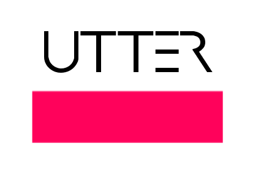

# Installation
  gem install utter
#Usage
* > utter help                 # lists all commands
* > utter new users v1         # creates ver1 api and model for users
* > utter new users v2
* > utter new services v1
* > utter new services v2

# Utter's Tenets for Good Web API Design 
- Use plural instead of singular (/dogs instead of /dog)
- Enforce the use Versioning as v1, v2, v3, NOT v1.0.1 or v1.1 
- Package and deploy your versioned API to your Production Server 
- Ability to nodifiy developers with the depreciation of the earlier versions, simply by adding Depreciated keyword in your API ruby file.
- Use HTTP Codes as much as possible
- Partial response /users?fields=name,age,loction to cut down on band width
- Pagination using limit and offset /dogs?limit=25&offset=50 
- Ensuring response format  /dogs.json  /dogs/1234.json /dogs.xml /dogs/1234.xml  
- defaults: json, limit&offset,  

# Interface Driven-Development 
- Automatically extracts API model from your ruby code and generates backbone.js code for your UI (interface driven development)

# Join the Development of Utter 

Rule of Modularity: Write simple parts connected by clean interfaces.

Rule of Clarity: Clarity is better than cleverness.

Rule of Composition: Design programs to be connected to other programs.

Rule of Separation: Separate policy from mechanism; separate interfaces from engines.

Rule of Simplicity: Design for simplicity; add complexity only where you must.

Rule of Parsimony: Write a big program only when it is clear by demonstration that nothing else will do.

Rule of Transparency: Design for visibility to make inspection and debugging easier.

Rule of Robustness: Robustness is the child of transparency and simplicity.

Rule of Representation: Fold knowledge into data so program logic can be stupid and robust.

Rule of Least Surprise: In interface design, always do the least surprising thing.

Rule of Silence: When a program has nothing surprising to say, it should say nothing.

Rule of Repair: When you must fail, fail noisily and as soon as possible.

Rule of Economy: Programmer time is expensive; conserve it in preference to machine time.

Rule of Generation: Avoid hand-hacking; write programs to write programs when you can.

Rule of Optimization: Prototype before polishing. Get it working before you optimize it.

Rule of Diversity: Distrust all claims for “one true way”.

Rule of Extensibility: Design for the future, because it will be here sooner than you think.

http://www.faqs.org/docs/artu/ch01s06.html
  It is a simple, easy-to-follow, and in-the-shadows opensource project with a very lonely "terminally ill" maintainer who would do his best to share his knowledge with you. 

  And remmber to "try not to become a man of success, but rather try to become a man of value" ~ Albert Einstein

“I am not an Athenian or a Greek, but a citizen of the world." ― Socrates
"“To be is to do” - Socrates
# Refrences
We would like to thank APIGee for their awesome webcasts that made building Utter a joy.

